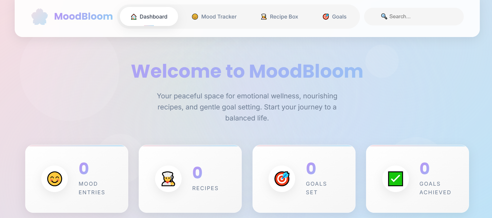
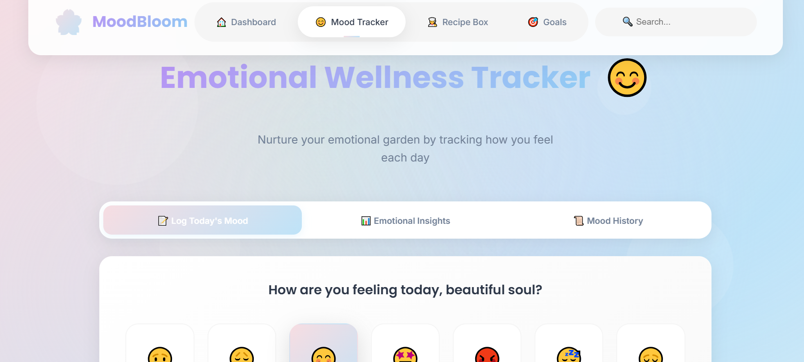
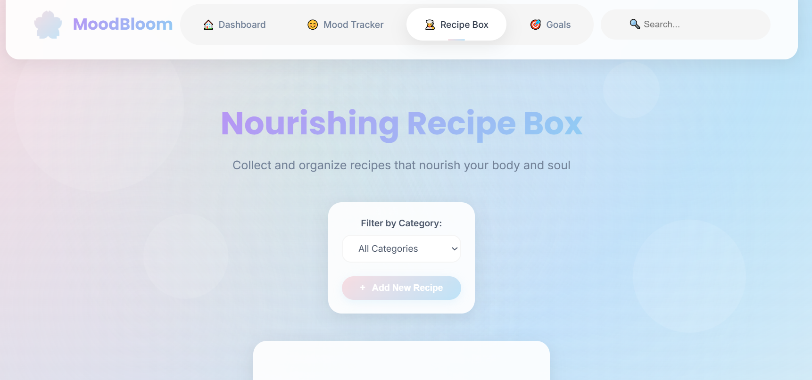
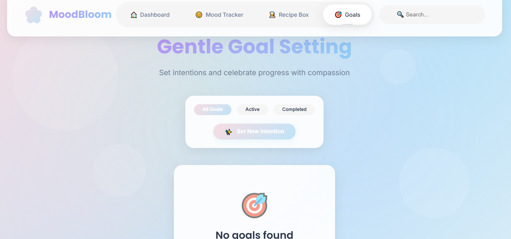

# 🌸 MoodBloom - Emotional Wellness Dashboard

> A beautiful, minimalist dashboard for tracking moods, organizing recipes, and setting gentle goals. Your personal space for emotional wellness and self-care. 🌿

## ✨ Features

### 🌈 **Emotional Wellness Tracker**
- **Daily mood logging** with beautiful emojis
- **Reflective notes** for deeper self-awareness
- **Emotional patterns visualization** with interactive charts
- **Mood history** with gentle deletion options
- **Intelligent insights** based on your emotional patterns

### 🍽️ **Nourishing Recipe Box**
- **Recipe collection** with ingredient lists and steps
- **Meal categorization** (Breakfast, Lunch, Dinner, Snacks, Desserts)
- **Prep/Cook time tracking**
- **Servings management**
- **Beautiful recipe cards** with soft pastel design

### 🎯 **Gentle Goal Setting**
- **Intention setting** with compassionate language
- **Progress tracking** with visual indicators
- **Task breakdown** into manageable steps
- **Priority levels** (High/Medium/Low)
- **Completion celebration** with achievement markers

### 🎨 **Beautiful UI/UX**
- **Soft Pastel Wellness Theme** - Calming colors for emotional tracking
- **Hidden Smart Header** - Appears on hover for minimalist design
- **Floating Animations** - Gentle movements for visual delight
- **Responsive Design** - Perfect on mobile, tablet, and desktop
- **Glass Morphism Effects** - Modern, frosted glass appearance

## 📸 Screenshots

  
| Dashboard | Mood Tracker | Recipe Box | Goal Setting |
|-----------|--------------|------------|--------------|
| | |  |  |

## 🚀 Quick Start

### Prerequisites
- Node.js (v14 or higher)
- npm or yarn

